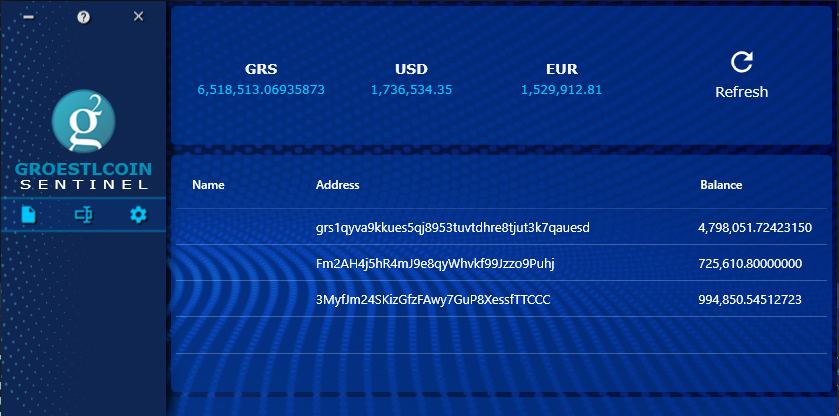

  
# Watch Only Groestlcoin Wallet

This is a simple open source tool created to help keep track of bitcoin addresses and their balances in a light application.

## Features
1. Capable of holding multiple groestlcoin addresses with tags, address and their balances.
2. Validating each address with Base58_encoding and new Bech32 format for Segregated Witness.
3. Using a grid (like excel) to show the list which makes it easy to add/edit/remove items.
4. Import addresses in bulk from file or paste in textbox (seperate by newline).
5. Using block explorer API services to update balances (Chainz.CryptoId.Info).
6. See the total groestlcoin amount in BTC, USD and user defined local currency.
7. USD value can be retreived from Chainz.CryptoId.Info or CoinMarketCap using their API.

### Don't forget to leave your feedback, Thank you.
**Wanna help?** 

Then review the code and leave your feedback.

**Wanna help more?**

[Donate: FYoKoGrSXGpTavNFVbvW18UYxo6JVbUDDa](groestlcoin:FYoKoGrSXGpTavNFVbvW18UYxo6JVbUDDa)  

Special thanks to Coding Enthusiast.
